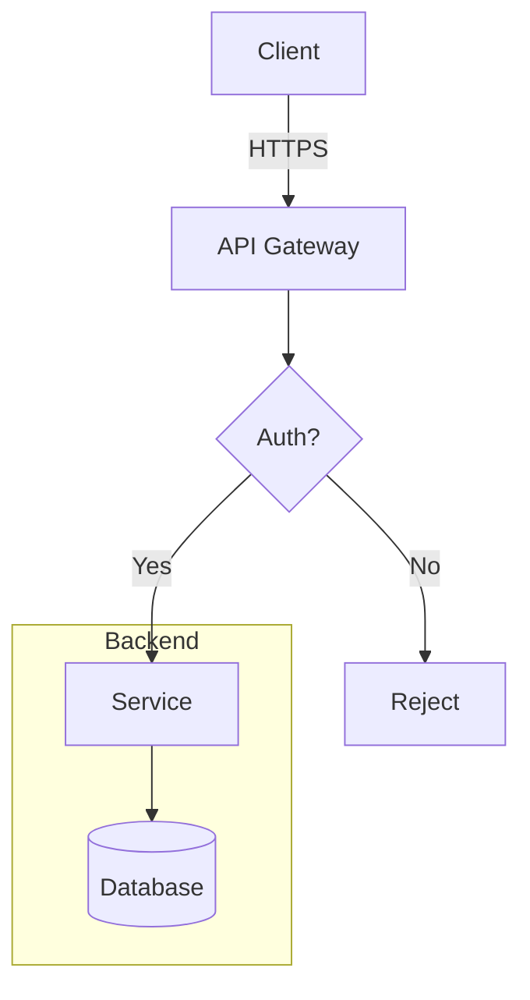
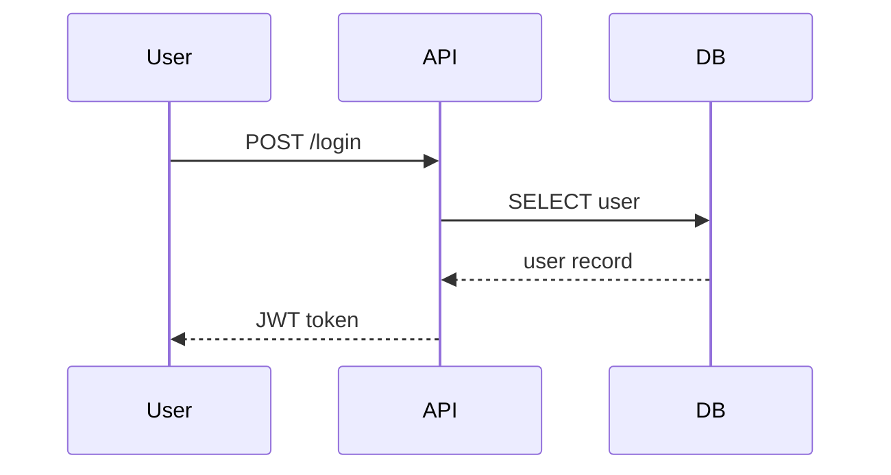
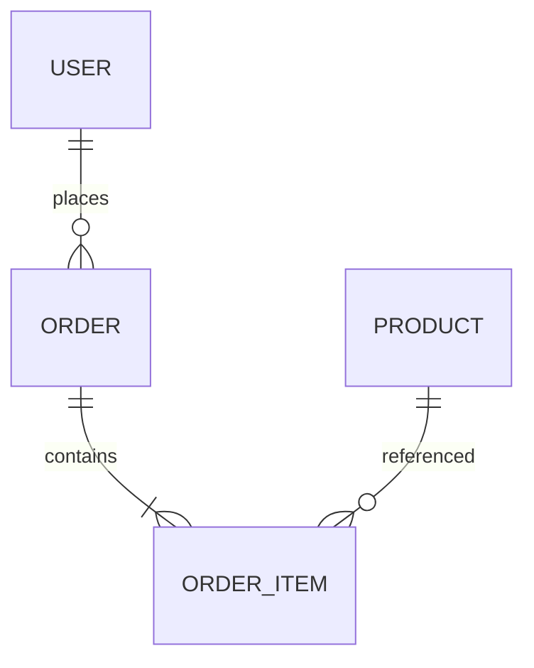
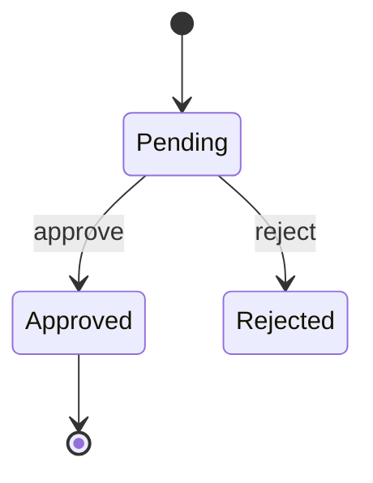

# Diagram

Act as an architecture expert and draw diagrams from input.

Find what to draw:
1. If given a file/folder path → read the code/docs and draw a diagram from what's there
2. If given a text description → use that content
3. If given a URL → review the content (when possible) and draw from what you find
4. If nothing specified → ask what to draw, along with audience and intent

---

## Philosophy

A good diagram = **clear communication + abstraction level matched to audience + tells the real story, not just colors-by-command**

Three things that make this skill different from generic diagramming:
- **Auto-selects the right type** — based on what you're trying to communicate, not a default
- **Critiques the architecture** — not just drawing what's asked; flags issues when they show up
- **Multiple views for large systems** — never crams 30 nodes into one diagram

**Primary format: Mermaid** — renders natively in Claude Code, GitHub, Obsidian, Notion with zero setup.

---

## Step 1: Understand Intent & Audience

Before drawing, clarify (if not already given):

| Question | Why it matters |
|---|---|
| **Who's reading it?** dev / business / new joiner / yourself | Sets the level of technical detail |
| **What's the main message?** structure / flow / data / sequence / decision | Determines diagram type |
| **Which view?** high-level / component zoom-in / deployment | Defines scope |
| **As-is or to-be?** | Shapes how to critique |

If the user gave enough in the first message → skip questions but briefly state your interpretation.

---

## Step 2: Pick the Diagram Type

Use this table to choose the right type (don't default to flowchart for everything):

| To communicate | Diagram type | Mermaid syntax |
|---|---|---|
| High-level system structure | C4 Context / Container | `graph TD` + `subgraph` |
| Internal structure of a component | C4 Component | `graph TD` + `subgraph` |
| Deployment onto real machines | Deployment | `graph TD` + `subgraph` per node |
| Time-ordered interactions | Sequence | `sequenceDiagram` |
| Decision logic / process flow | Flowchart | `graph TD` or `graph LR` |
| State changes | State diagram | `stateDiagram-v2` |
| Data model (DB schema) | ER diagram | `erDiagram` |
| OOP class structure | Class diagram | `classDiagram` |
| User flow / experience | User journey | `journey` |
| Timeline / project plan | Gantt | `gantt` |
| Proportions / distribution | Pie chart | `pie` |
| Network topology | Network | `graph LR` + custom style |

**Type selection rules:**
- Words like "steps" / "process" → flowchart
- Words like "who calls whom" / "API call" → sequence
- Words like "tables" / "data relationships" → ER
- Words like "deploy" / "server" / "container" → deployment / C4 Container
- Words like "state" / "status changes" → state diagram

If torn between two types → tell the user, explain the trade-off, and ask to confirm.

---

## Step 3: Extract Entities and Relations

Read all input, then list:

| Element | Examples |
|---|---|
| **Actors** | User, Admin, External system |
| **Components** | Service, Module, Page, Container |
| **Data entities** | Database, Cache, Queue, File store |
| **Relations / flows** | API call, message, data flow, dependency |
| **Boundaries** | Team, network zone, deployment unit, security boundary |

**Critical rule:** Level of abstraction must stay consistent
- ❌ Don't put `UserController` next to `PostgreSQL database` in the same diagram
- ✅ Either raise both: `Backend Service` ↔ `Database`
- ✅ Or split into two views: high-level (services) + zoom-in (controllers)

---

## Step 4: Draw with Mermaid

Principles for good Mermaid code:

### Code structure
```
[diagram type]
    [title if needed]
    [definitions, ordered along the reader's visual flow]
    [relationships]
    [styling, only if necessary]
```

### Mermaid cheat sheet (most common patterns)

**Flowchart (architecture, process):**


**Sequence (interaction over time):**


**ER (data model):**


**State diagram:**


### Drawing rules

- **Title** — add one if the diagram lives inside a document (use `%%` comment or a markdown heading)
- **Edge labels** — describe the relationship (`-->|HTTPS|`, `-->|sync|`)
- **Shape conventions:**
  - `[Square]` = component / service
  - `([Stadium])` = start / end
  - `{{Hexagon}}` = decision / gateway
  - `[(Cylinder)]` = database
  - `((Circle))` = endpoint / actor
  - `>Asymmetric]` = input
- **Subgraphs** — group items that share a boundary (team, zone, deployment unit)
- **Direction** — TD (top-down) for architecture, LR (left-right) for flow

### Diagram size

- **7±2 nodes** per diagram = optimal for readability
- Over 15 nodes → split into multiple views
- Never try to fit "everything" into one diagram — it becomes unreadable

---

## Step 5: Validate

Check the finished diagram before delivering:

| Dimension | What to check |
|---|---|
| **Syntax** | Mermaid syntax correct? `graph TD` uses `-->` not `->`? quotes closed? |
| **Orphan nodes** | Any node not connected to anything? |
| **Missing relations** | Gap in the flow? "A goes to C" with no B in between? |
| **Level consistency** | Abstraction level stays consistent — no mixed layers |
| **Label clarity** | Important edges labeled? Every node clearly named? |
| **Size** | ≤ 15 nodes? If not, split into more views |
| **Direction** | Flow direction correct? (e.g. sync vs async) |

---

## Step 6: Critique the Architecture

Don't just draw — look at the diagram and report what you see:

### What to look for

**🔴 Critical issues:**
- **Single Point of Failure (SPOF)** — any single node that takes down everything if it fails?
- **Tight coupling** — components talk to each other too directly, no abstraction layer
- **Circular dependencies** — A → B → C → A
- **Missing error paths** — no handling for when a component fails
- **Unclear security boundary** — internal vs external, trusted vs untrusted mixed together
- **Data flow violates principles** — e.g. frontend talking directly to the database

**🟡 Worth considering:**
- **Missing infrastructure** — no logging, monitoring, cache, queue where there should be
- **Scalability bottleneck** — a component that will become a chokepoint
- **God component** — one component talking to everyone, doing everything
- **Chatty interface** — too many back-and-forth calls between two components
- **No async path** — heavy work all happens synchronously

**🟢 Just observations:**
- Components that could potentially merge
- Parts that may need to split in the future
- Patterns worth noting / already done well

---

## Step 7: Suggestions and Multiple Views

### Multiple views (for large systems)

If the system has multiple layers → offer to draw additional views:

| View | When to use |
|---|---|
| **Context** (C4 L1) | Communicating with non-dev stakeholders |
| **Container** (C4 L2) | Devs discussing architecture |
| **Component** (C4 L3) | Zooming into one container |
| **Sequence** | Explaining a critical flow (login, payment) |
| **Deployment** | Talking with ops about infrastructure |

Ask the user whether to draw additional views.

### Final output format

```markdown
## Diagram: [what you drew]

**Type:** [diagram type] — chosen because [reason]

[Mermaid code block]

### Legend
- [explain shapes/colors if relevant]

### 🔍 Observations (Critique)

🔴 **Watch out:**
- [point] — [problem + suggested fix]

🟡 **Worth considering:**
- [...]

🟢 **Already done well:**
- [...]

### 📐 Suggested additional views
- [if there's a view worth drawing next]
```

---

Rules:
- **Pick the type from intent, not from default** — flowchart is not the answer to everything
- **Don't cram one diagram** — over 15 nodes always means splitting into multiple views
- **Keep abstraction level consistent** — never mix `UserController` next to `PostgreSQL`
- **Every important edge needs a label** — what is it? (HTTP? sync? async? data?)
- **Critique with reason** — flag issues you actually see, not to look smart
- **If the architecture is already good** — say so, don't manufacture criticism
- **If unsure about syntax** — check the cheat sheet above, don't guess
- **Never draw a diagram too large to read** — an unreadable diagram is useless
